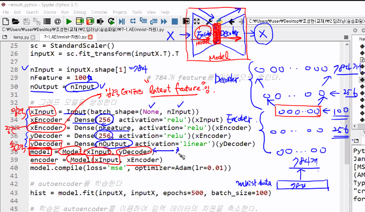

# AutoEncoder

Autoencoder 는 출력과 입력 데이터가 같아지도록 학습한 네트워키이기 때문에 supervised learning이 아닌 self-supervised learning 이다.

Encoder:  input data 가 hidden layer 에 비해 수가 많다면 확장, 적다면 압축 된다

Decoder: Hidden layer 속의 데이터를 Output data (= input data) 로 변환 해주는 것을 decoding이라 한다

## 차원 축소

Autoencoder 의 역할 중에 차원 축소가 존재한다.

차원축소에 있어서 주용한 feature를 없애지 않는 것이 중요하다...

>  deep learning 에서 표준화는 필수이다.. 이유는 feature 마다의 영향을 줄 수 있는 값에 영향이 크기 때문이다.

