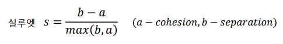

# K-Means

## K-Means Clustering 알고리즘

Unsupervised Learning 으로 데이터를 k 개의 cluster 로 나눈 뒤 임의의 centroid 를 주고 해당 centroid 와 cluster의 중점의 거리를 찾아 평균지점을 새로운 centroid로 사용한다.

해당 방식은 초기 중점에 따라 centroid 가 완벽하게 cluster마다 분류 되지 않을 수 있다.

이는 global 하게 움직이지 않고 local minimum value 를 찾기 때문이다... 

## K-Means Elbow Method

K-menas는 Unsupervised learning 이기 때문에 정답에 해당하는 값이 존재하지 않아 error 값도 존재하지 않는다 다만, clustering이 잘 진행 된다면 centroid 와 clsuter 내의 데이터 간의 거리의 합이 작기 때문에 SSE (sum of the squared difference) 을 error 대신에 사용 가능 할 것이다.

K의 값이 증가할 수록 SSE는 줄어들지만 줄어드는 폭도 작아진다. K 가 증가하는 폭이 갑자기 작아지는 지점의 K 값이 최적 cluster라고 할 수 있다 생각 하는 것이 Elbow method 이다

## Silhouette Method

Silhouette method 의 경우 cohension과 separation 을 비교하는 것이다.

cohension의 경우 임의의 cluster 안의 데이터 x 가 해당 cluster 의 다른 데이터와의 평균거리를 의미하며 (즉 자기 자신의 cluster 속 다른 data들과의 거리)

separation의 경우 인접 cluster 내의 데이터들과의 평균거리이다.

silhouette 은 아래와 같이 계산된다

분리가 잘 된 경우 separation이 cohension보다 크기 때문에 silhouette 값이 크지만, cluster가 겹치거나 분리가 잘 안된 경우 계수가 작아진다. 

## K-Means ++ 

local optimum 의 centroid 가 생기는 것을 방지하기 위하여 초기 centroid를 어려번 다르게 설정하여 거리의 합이 최소가 되는 지점의 최종 centroid로 설정한다. 

## K-means 알고리즘

사람의 경우 패턴의 모양을 인식하지만 기계는 모양이 아닌 거리의 차이를 판단한다

# H-cluster

K-means 는 아니지만 clustering 이 작기에 적음...

K-means와의 차이점은 K-means의 경우 k를 사전에 선택하지만 H-cluster의 경우 그룹을 나눈 뒤 dendrogram을 통해 그룹의 개수를 선택가능하다

# DBSCAN (Density Based Spatial Clusteng of Applicantions with Noise)

DBSCAN 은 밀집도 반의 군집 알고리즘이다. 특정 밀집도 안에 있는 샘플의 개수를 구하며, 반경 (**ε**) 안에 있어야할 최소의 데이터 개수 (min point) 를 정의한다.

모든 데이터 마다 **ε** 반경의 원을 그린 뒤 데이터의 개수가 사전의 min point를 넘을 경우 core point 라고 하며, 아닐 경우 border point 나 noise point 가 된다.

border point 의 경우 **ε** 안에 min point 의 데이터는 확보하지 못 했으나, core point 가 한개라도 존재하면 border point 가 되지만 단 한개의 core point 라도 없다면 nosie point 가 된다. 