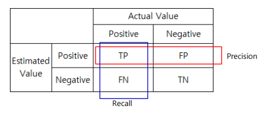
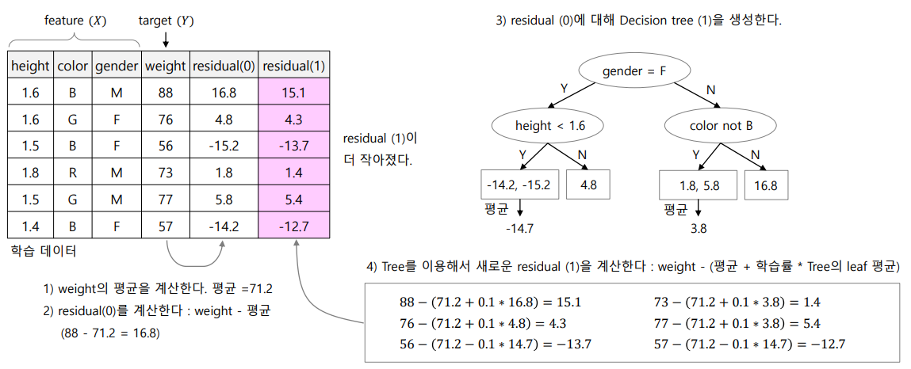
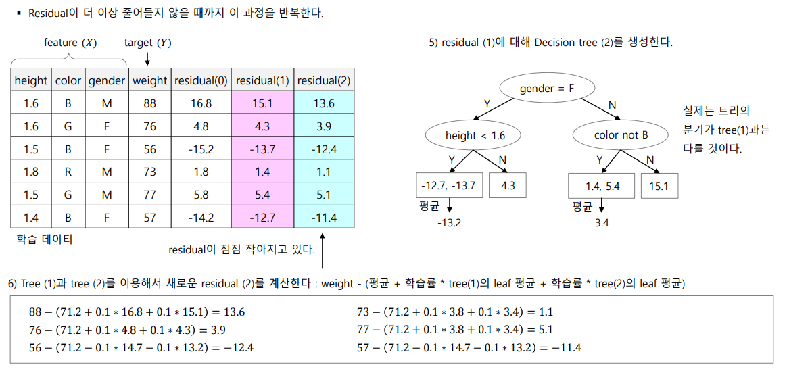

# Ensemble 

Overfitting 의 경우 train data에 대한 accuracy 는 상승하지만 test data 에 대한 설명력이 떨어지기 때문에 regularization을 진행한다. 

## Cross Validation

train data로 사용했던 data로 평가를 하면 좋은 성과가 나오기 때문에 train data와 test data를 계속 랜덤하게 분산시켜 사용...

K-fold cross validation 전체 구간을 나눈 뒤 train data와 test data를 학습한 뒤 바꾸어 학습을 시켜 accuracy 와 error 등을 줄임

## Confusion Matrix

Accuracy는 맞게 분류한 것을 의미하며 

Precision은 Estimate를 positive 라고 했을 때 actual value 가 negative 인 경우를 의미하며,

Recall 은 Acutal value 가 positive 일 때 estimate를 negative로 한 경우이다

## Major voting

VotingClassifier() 를 사용하여 데이터를 분석한다.

기존 classification을 했던 방법을 다 사용하여 model 을 만든 뒤 해당 모델로 값을 추정하는 방식이다...

 ## Bagging 

훈련 데이터를 반복적으로 샘플링 하여 서브 훈련 데이터를 만들어서 overfit 을 감소시킨다

## Boosting 

Bagging 과 개념이 비슷하지만, 분류가 잘못된 데이터의 갖중치를 높혀 샘플링을 진행한다. 즉 잘못 분류된 패턴의 선택 확률을 높혀 정확도를 높히는 방법이다

## Random Forest 

Decision tree 를 위한 ensemble 방법으로 train data를 sub data로 나누어 tree 를 n 개 생성 한 뒤 결과만을 종합한다. 

## AdaBoost  (Adaptive Boosting)

잘못 분류한 데이터를 더욱 학습시켜 정확도를 높히고 overfitting의 가능성이 높아진다...

## Gradient Boosting 

위와 같은 개념이 regression 이며, classification도 개념은 동일하다. 다만, 추정치를 위해 odds, log(odds), probability 의 개념을 사용하며, binary cross entropy를 사용한다.

즉 최종적으로 residual 이 줄어들지 않을 때 까지 사용한다고 생각하면 된다.

## XGBoost (Extreme Gradient Boosting)

일반적 gradient boosting 보다 메모리 효율이 좋으며 속도가 빨라 대용량 데이터 처리가 편하다

또한 regularization과 pruning을 통해 overfitting을 줄이고 일반화 특성을 좋게 만든다

Simularity socre 를 통해 gain 을 계산하며 gain 이 0 보다 클 때 계속 분기한다.

## Isolation Forest (iForest)

Decision Tree에서 outlier는 빨리 분기되어 leaf node 에 홀로 남게 될 확률이 높아진다. 때문에 해당 데이터를 이상치로 판단하는 방식이다. 이러한 방식은 신용카드 이상 사용치 같은 곳에서 사용이 가능하다...