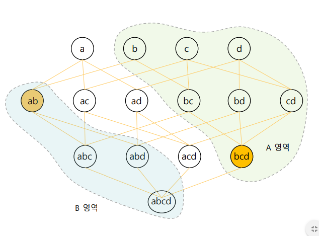

# Association

Association의 경우 항복들간의 관계를 찾아내는 분석이다.

해당 분석은 고객의 구매 성향 등에서 사용 가능하며 결과적으로 마케팅, 재고관리 등 다양한 비즈니스에서 활용이 가능하다. 

## Association rules 

### Support

특정 집합을 포함하는 트랜잭션의 개수이다. 즉 support 가 높을 수록 연관성이 높으며 낮을수록 우연히 발생한 확률이 높다

### Confidence

다만 support 의 경우 얼마나 자주 나타내는지를 결정하지 때문에 X, Y 를 구입한 사람이 Z 를 구입할 support 값과 Y,Z 를 구입한 사람이 X 를 구입할 support 값이 동일하다

때문에 Confidence 는 X,Y를 구매한 사람이 Z 를 구매할 처고를 나타내준다. 하지만 이것이 인과관계를 의미하는 것은 아니다. 

### Lift

하지만 Confidence 도 특정 값이 원래 많이 나오는 것을 분류할 수는 없다. 즉, X,Y를 구매한 사람이 z 를 구매하는 것이 아니라 원래 Z 를 많은 사람들이 구매하는 것일 수 있다. 

때문에 Z 가 Confidence 에 대한 영향을 무시한다. 때문에 Z 가 얼마나 빚ㄴ번히 발생하는지 고려해주어 Confidence를 Z 로 나누어 발생빈도에 대한 척도이다. 

즉 Z 의 발생이 많을 수록 lift 척도가 낮아지게 된다. 

## Apriori

BCD 가 빈번하다면 A 영역의 부분이 빈번할 확률이 높으며

AB 가 빈번하지 않다면 B 영역의 부분이 빈번하지 않을 확률이 높다 