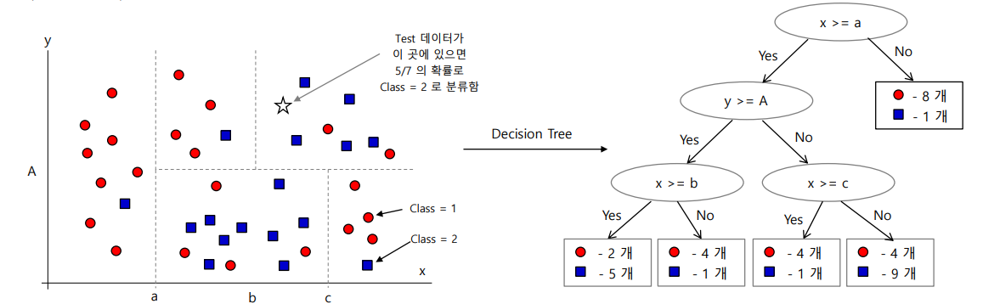
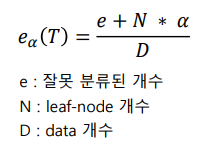

# Decision Tree

## 개념

이미지와 같이 데이터들을 구분지어 분류하는 방식이다. feature 가 3 이상일 때는 (초)평면으로 구분한다.

tree 의 분류가 세분화 될 수록 train data의 정확도는 올라가지만, test data의 정확도는 낮아지는 overfitting 현상이 발 생한다.

overfitting 을 방지하기 위해 pruning (pre / post) 방식이 존재한다.

##### random forest

Random Forest는 훈련데이터 자체를 쪼개어 데이터마다의 트리를 구성한 뒤 결과를 취합하는 방식으로 정확도 향상이 가능하다.

### Impurity (불순도)

데이터를 분할하는 Decision Tree 에서 데이터를 잘 분류하는 것이 중요하다.

이러한 분류를 도와주는 개념이 impurity이다. impurity가 높다면 부정확한 분류가 진행 됨으로 학습에 적합하지 않다. 이러한 불순척도는 entropy와 gini index가 있다. 

양 척도 모두 확률이 0.5 일 때 (즉, a 그룹 b 그룹에 속할 확률이 0.5 0.5 일 때) 가장 불순도가 높다.

### KNN 과 차이점

feature 가 다양해져도 분류에 덜 중요한 feature가 있다면 분류 기준에서 제외 되기 때문에 차원의 저주에서 더 자유롭다. 또한, feature 마다 영향을 끼치는 정도를 파악하여 feature의 중요도를 파악 가능하다. 

## Pruning 

트리가 복잡해지지 않게 단순화 심키는 것을 의미한다.

### Pre-Pruning 

트리의 depth, node의 최소 데이터 개수, impurity 값의 정도 등을 통해 특정 값이 도달 시 더 이상의 tree 분할을 멈춘다

### Post-Pruning

최대 크기의 tree (Full tree) 에서 불순척도가 최소가 되도록 분할 한다.

해당 식을 통해 error 를 최소화 시키는 방법을 시행한다. 