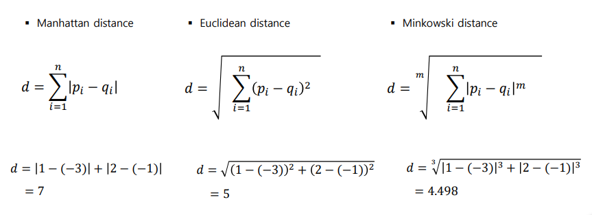

# KNN (K-nearest neighbor근접이웃 알고리즘)

## 개념

1. 특정한 데이터와 모든 훈련 데이터 사이의 거리를 측정

2. 측정한 거리가 작은 순을 K개의 데이터를 찾음
3. K의 속한 클래스가 가장 많은 것을 다수결의 원칙으로 결정
4. 훈련 데이터와 시험 데이터의 변경을 통해 정확하게 분류하는 K 값을 찾는다 (Cross Validation)

### 거리 측정 방법

> 거리 측정 방법에는 여러가지가 있지만 가장 많이 쓰이는 3가지를 살펴보자

Manhattan distance 의 경우 단순히 거리의 합을 구하는 것이다. (예를 들어 2차원의 경우 x1, y1와 x2, y2 의 차이의 합이다)

Euclidean distance 의 경우 두 점의 최단거리로 피타고라스 정리를 떠올리면 이해하기 쉽다

Minkowski distance 의 경우 Manhattan 과 Euclidean 의 일반화로 m 이 1 일 때는 manhattan과 같은 값이 2일때는 Euclidean과 같은 값이 된다. 

### 최적의 K 값 찾기

시험용 데이터와 학습용 데이터의 정확도를 체크하면 K 값이 증가함에 따라 (고차원이 됨에 따라) 차원의 저주에 의해 정확도가 떨어진다. 때문에 test와 train data의 정학도를 잘 반영하는 hyper-parameter K 를 찾아내는 노력이 필요하다.

#### lazy-learning 

KNN 의 경우 데이터의 개수가 많으면 시간이 오래 걸리는데 이유는 미리 학습하는 것이 아닌 시험 데이터를 매번 학습하기 때문이다. 