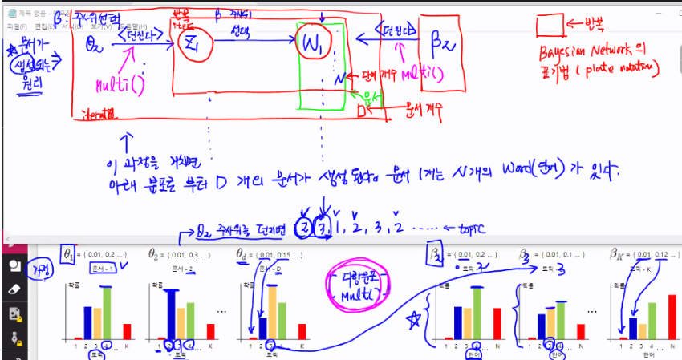
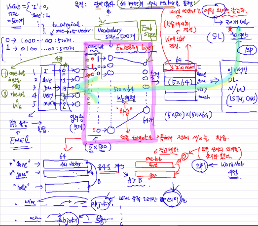

# NLP 실습

## TF - IDF

빈도를 기반 하여 중요도 및 유사성을 판단한다

Term 과 Documents (term 으로 이루어진 문서) 를 비교할 때

DF (document frequency): DF 가 높은 단어는 여러 documents 에서 자주 사용되었다는 것을 의미한다 (즉 general 한 term = 중요도가 낮을 확률 이 높다)

> 단어의 중요도 ∝ 1/Df ∝ TF


TF = Term-Document Matrix 에서 해당 documents 에서 term 이 나올 확률

IDF = log(documents number / DF)


단어의 중요도 ∝ TF ∝ IDF 그렇기 때문에 TF * IDF에도 비례한다

TF-IDF 값이 검색문의 문서 vector 가 된다. 그렇기 때문에 두 vector 간의 내적거리을 구하며 유사도를 측정 가능하다


### Topic Model

차원 축소에는 두가지 방법이 있다

선형대수 이론 :  PCA ~ 														(고유값 분해)

​							SVD -~ Singluar Value Decomposition (특이값 분해)

SVD 는 차원축소 뿐 아니라 Topic Model 에도 쓰인다 'LSA' 

> LSA  = Latent Semantic Analysis 를 사용한다


#### Topic Model

LSA : SVD 원리를 사용한다

LDA : 결합확률 분포를 취급하며 문서와 단어 조합을 계산하는데, 이는 너무 어렵기 때문에 Sampling 기법을 사용한다. 이 중 'Gibbs' sampling 을 가장 많이 사용한다

LDA - 두개의 다항 분포를 추정하고, 해당 문서를 특정 topic 에 할당하는 것



이러한 flow 로 LDA 는 진행된다. 하지만, 실제 문제는 observed 된 document만 가지고 topic과 word를 추론한다.


### Text-to-Vector

#### 1. 통계적 기반, 빈도기반, 카운트 기반 => TFIDF, BOW(Bag of word)

#### Bow:

'I love you very much, you love me too'

vocab_list = [I : 0, love : 1, you : 2]

BoW 

> 1) [0, 1, 2 ..... 2, 1, x , y]

> 2) [(0,1), (1,2), (2,2).....]

Doc2Bow 실행시 2) 와 같이 적용이 된다

```python
import numpy as np
import re
from nltk.corpus import stopwords
from gensim import corpora
from gensim.models.ldamodel import LdaModel as LDA
from sklearn.datasets import fetch_20newsgroups

newsData = fetch_20newsgroups(shuffle=True,
                             random_state=1,
                             remove=('headers', 'footers', 'quotes'))
# preprocessing 영문자가 아닌 문자를 regular expression 으로 제거
news1 = []
for doc in news:
    news1.append(re.sub("[^a-zA-Z]", " ", doc))
# stopwords(불용어)를 제거
# doc2bow 생성한다
vocab = corpora.Dictionary(news2)
dict(list(vocab.items())[:10])
news_bow = [vocab.doc2bow(s) for s in news2]
print(news_bow[0])

# 결과값은 아래와 같다
```

>{0: 'acts',
> 1: 'atrocities',
> 2: 'austria',
> 3: 'away',
> 4: 'biased',
> 5: 'blessing',
> 6: 'clearly',
> 7: 'commited',
> 8: 'daily',
> 9: 'degree'}

```python
model = LDA(news_bow, 
            num_topics = len(newsData.target_names), 
            id2word=vocab)
# LDA(corpus, num_topics=, id2word=(dict(int,str)))
```

토픽별로 중요 단어들이 나오게 된다


`vocab.token2id` 를 사용하면 vocab list 에서 속해있는 단어의 id 번호를 볼 수 있다


#### 2. Embedding 기반 (후술...)


### Document Summary

#### TextRank

각 문장의 TextRank 초기화...

TR(a) = TR(b) = TR(c) = TR(d) = 1/4 = 0.25

그 뒤 문서간 유사도를 측정 하고 해당 값을 통해 weight 를 제공한다

textRank 계산 - 반복 진행한다.

### Anaphora Resolution (조응어 해석)

John is a man. He walks. 에서 He 는 John을 재 표현한 것이다.

즉 He 는 John 에 의존 하며, 앞에 나온 단어에 의존 하는 것을 `전방조응`이라 하며 

I do not want to meet him. John was being mean to me. 와 같이 him 이 뒤에 나오는 문장 John을 의미한다면 `후방조응` 이라고 한다

이름을 구별하기 위해서는 문장 구조를 분해해야하고 (chunk), 이름의 성별을 구별하기 위해서 name corpus 를 사용한 학습을 진행한다. 


## Word Embedding

현재 NLP의 주류가 되는 원리는 단어기반이다. 이는 의미를 가지는 가장 작은 단위가 단어이기 때문이다. 

이러한 단어의 빈도수를 수치화 하여 자연어분석을 하는 방식이 지금까지 배운 TFIDF / BoW / Doc2BoW 같은 방식이다. 하지만 이런 빈도기반의 분석 방식은 단어 자체에 의미를 부여하지 못 하고 이로 인해 중요도 같은 판단에 있어 정확도가 낮아질 수 밖에 없다.

단어에게 의미를 부여하기 위해서는 학습 과정이 필요하며, 학습을 통해 단어를 수치화 (벡터화) 하는 방법을 통해 word embedding이 이루어진다.



단어간의 embedding 값을 가져와서 비교하는 것도 가능하고, CNN LSTM 을 병합하여 사용하는 것도 가능하다