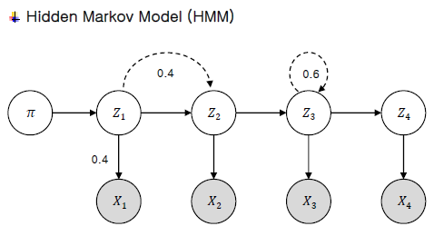

# Part-of-Speech Tagging (품사)

part-of-speech (pos) 는 명사, 동사 등을 태깅해주어 문맥을 파악하는데 도움을 준다

I love you 같은 경우 love 가 명사가 아닌 동사로 사용이 되었으며, 이를 판단 하기 위해서 앞 뒤 context를 파악해야한다

몇 개를 참조하냐에 따라 명칭이 다르다  1개 unigram / 2개 bigram / 3개 trigram / 4개 이상 특별용어 X

## Hidden Markov Model

X1, X2 는 같은 단계의 z1 z2 에 의존을 한다. 하지만, z는 이전 상태에 의존을 하게 된다

### 1. Evaluation Question
초기상태초기상태(𝜋), 천이확률천이확률(𝑎), 출력확률출력확률(𝑏)이 주어진 경우 관측치 𝑋시퀀스가 나올 확률 계산

Forward / Backward Algorithm

** Backward 의 경우 Time 상에서는 이해가 되지 않지만, 언어 상에서는 뒤에 나오는 말이 앞에 나오는 말에 영향을 줄 수 있다는 것을 생각하면 좋다