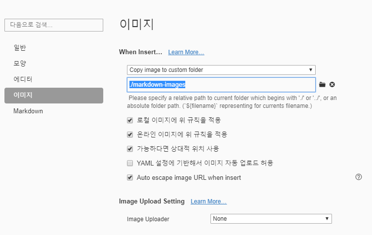

# 마크다운 문법 정리

## 제목 (Heading)

제목은 ` #` 의 갯수로 표현된다. 

H6, 제목을 6단계까지 구분하여 작성 가능하다.

제목을 잘 작성해두면, Overview 나 목차로 활용 가능하다.

### 제목3

#### 제목4

##### 제목5

###### 제목6


## 목록

* 순서가 없는 목록은
* `*` 으로 작성된다.
  * tab을 누르면, 하위 목록으로 작성 가능하다
* shift + tab 은 상위 목록 레벨으로 작성 가능하다 

1. 순서가 있는 목록은 
2.  `1.` 으로 시작하면 된다.
   1. 하위 목록으로도 작성 가능하다.
   2. `tab` `shift+tab` 모두 먹힌다...
      * 섞어서 사용도 가능합니다...


# 코드블록

```python
import random
numbers = range(1, 46)
print(random.sample(numbers, 6))
```

다양한 프로그래밍 언어에 대한 syntax highlighting 기능을 접할 수 있다.

```html
<h1>
    안녕
    import random
</h1>
```

### 인라인 코드블록 (`)

인라인 코드블록은 아래와 같이 활용 가능하다.

본 프로젝트는 `tensorflow` 를 활용하였습니다.

출력을 하기 위해서는 `print` 함수를 사용합니다. 


## 텍스트 기타 문법

*강조(기울임 italic)* 

**강조(굵게 bold)**

~~취소선~~


## 링크

[구글](https://google.com) ctrl+click 시 이동 된다

[git 문서](./git.md)

## 이미지 


* 기본 설정으로 이미지를 가져오면 절대 경로로 표기된다. (C드라이브~)

* 이 경우, Github 혹은 다른 컴퓨터에서는 해당 이미지가 없어 깨지는 현상이 발생할 수 있다. 따라서 아래의 설정을 해주자.

  

## 표

| 순번 | 이름   |
| ---- | ------ |
| 1    | 홍길동 |
| 2    | 김철수 |